<div align="center">

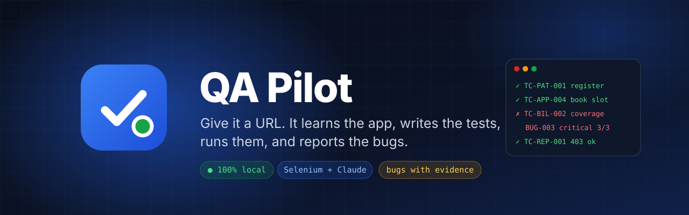

<br>

[](https://github.com/YOUR_USERNAME/qa-pilot/actions/workflows/ci.yml)


</div>

**QA Pilot** is an AI QA engineer that runs on your own computer. Give it the URL of a web app and a test
account per role: it explores every screen, works out what the app is for, writes the requirements it implies,
designs test cases with standard techniques, runs them in a real Chrome browser, re-runs every failure to prove it,
and hands you developer-ready bug reports with annotated screenshots, video clips and a pytest suite.

<div align="center">

<!--
  demo.gif: record ~20 s at 1440×900 — New project → run overview stepper → Live Run Viewer → a bug detail page.
  Tools: ScreenToGif (Windows) or Kap (macOS); keep it under 8 MB; save as docs/assets/demo.gif.
-->
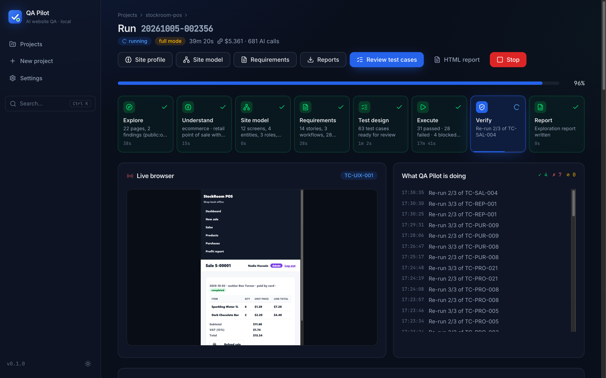

</div>

## Contents

[Highlights](#-highlights) · [100% local](#-100-local) · [Quick start](#-quick-start) · [How it works](#-how-it-works) ·
[Any industry](#-works-on-any-industry) · [Screenshots](#-screenshots) · [Sample outputs](#-sample-outputs) ·
[Test techniques](#-test-techniques) · [Benchmarks](#-benchmarks) · [Your data](#-where-your-data-lives) ·
[Configuration](#️-configuration) · [Safety](#️-safety--responsible-use) · [Tech stack](#️-tech-stack) ·
[FAQ](#-troubleshooting--faq) · [Roadmap](#️-roadmap)

## ✨ Highlights

<table>
<tr>
<td width="33%" valign="top">

**🧠 Learns the app by itself**<br>
Crawls every role, detects the industry, builds a knowledge graph of screens, records and flows, and writes the
requirements and business rules it implies.

</td>
<td width="33%" valign="top">

**🧪 Designs real test cases**<br>
13 techniques — boundary values, state transitions, permissions, data integrity, business rules with computed
expected values. You review and approve before anything runs.

</td>
<td width="33%" valign="top">

**🤖 Tests like a person**<br>
An AI agent drives Chrome one action at a time; rule-based checks cover smoke, permissions, responsive layout and
accessibility. Watch it live.

</td>
</tr>
<tr>
<td valign="top">

**🐞 Bugs you can trust**<br>
Every failure is re-run (3/3 = confirmed, 1/3 = flaky → review). Numbers in business rules are re-checked in Python.

</td>
<td valign="top">

**📎 Evidence developers love**<br>
Steps with data, expected vs actual, annotated screenshot, 10–25 s clip, full video, console and network logs,
one-click replay.

</td>
<td valign="top">

**📊 Reports for two audiences**<br>
PDF with a plain-language summary and Quality Score, Excel workbook, Jira/Trello CSV, traceability matrix, and an
exportable pytest + Selenium suite.

</td>
</tr>
</table>

## 🔒 100% local

> No database, no cloud, no accounts. Everything lives in `workspace/` as readable JSON, screenshots and videos you
> can zip, move or delete. The **only** external call is the Anthropic Claude API with **your own key**.
> Credentials are encrypted on disk and never appear in logs or reports.

## 🚀 Quick start

| You need | Notes |
|---|---|
| [Python 3.11+](https://www.python.org/downloads/) | Windows: tick *“Add python.exe to PATH”* |
| [Google Chrome](https://www.google.com/chrome/) | the driver is downloaded automatically |
| [Git](https://git-scm.com/downloads) | or download the ZIP |
| [Anthropic API key](https://console.anthropic.com/settings/keys) | pasted on the first screen |

**Node.js is not needed** — the UI ships pre-built.

**Windows**

```bat
git clone https://github.com/YOUR_USERNAME/qa-pilot.git
cd qa-pilot
setup.bat
start.bat
```

**macOS / Linux**

```bash
git clone https://github.com/YOUR_USERNAME/qa-pilot.git
cd qa-pilot
./setup.sh
./start.sh
```

QA Pilot opens at **http://localhost:8000** (or the next free port — the terminal prints it).

### Your first test in 2 minutes

1. Start the demo apps: `demo_targets\start_demos.bat` (Windows) or `./demo_targets/start_demos.sh`.
2. In QA Pilot click **Try with a demo app** — or **New project** → `http://localhost:8101`, environment *test*,
   and add the demo accounts:

   | App | URL | Accounts (`email` / `password`) |
   |---|---|---|
   | CarePoint Clinic | http://localhost:8101 | `admin@carepoint.test` / `Admin#2026` · `dr.lee@carepoint.test` / `Doctor#2026` · `reception@carepoint.test` / `Front#2026` |
   | DriveNow Rentals | http://localhost:8102 | `admin@drivenow.test` / `Admin#2026` · `agent@drivenow.test` / `Agent#2026` · `liam@drivenow.test` / `Drive#2026` |
   | StockRoom POS | http://localhost:8103 | `admin@stockroom.test` / `Admin#2026` · `cashier@stockroom.test` / `Till#2026` |

3. Watch it explore, review the requirements and test cases, press **Run approved tests**.

### Command line

```bash
cd backend
python cli.py run http://localhost:8101 --env test --mode full --confirm-full-mode --i-am-authorized \
    --role "admin:admin@carepoint.test:Admin#2026" --role "doctor:dr.lee@carepoint.test:Doctor#2026"
python cli.py review carepoint-clinic --confirm-rules 0.8 --approve all   # the review step
python cli.py execute carepoint-clinic --viewport desktop --viewport mobile
python cli.py export carepoint-clinic --kind qa_report_pdf --kind pytest_zip
```

(Use `..\.venv\Scripts\python` on Windows or `../.venv/bin/python` on macOS/Linux, or activate the venv first.)

## 🧭 How it works

`① Explore → ② Understand → ③ Site model → ④ Requirements → ⑤ Test design → ⑥ Execute → ⑦ Verify → ⑧ Report`

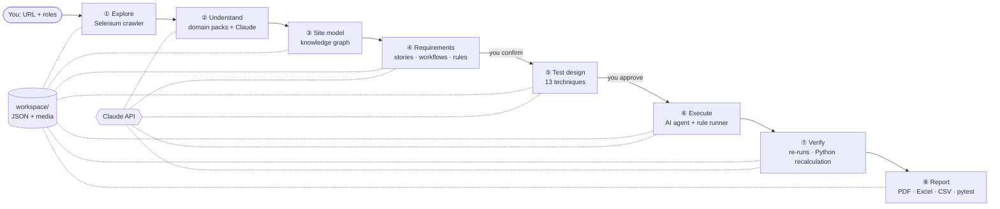

The browser agent sees an indexed list of the page’s elements plus a screenshot, picks **one** action per turn,
and every action passes the **Safe Mode** guard first. Details: [docs/ARCHITECTURE.md](docs/ARCHITECTURE.md).

## 🌍 Works on any industry

Domain packs give the engine the vocabulary, typical roles, workflows and rules of 12 industries. The three demo
apps (each with 15 planted bugs) were classified without any hints:

| Demo app | Detected as | What QA Pilot inferred (examples) |
|---|---|---|
| CarePoint Clinic | Healthcare · clinic management | insurance coverage rule for invoices, no double booking of a doctor, inactive doctors not bookable, cancelled visits can’t be completed |
| DriveNow Rentals | Rental · car rental back office | minimum one-day rental, 10 % discount from 7 days, no overlapping bookings, cars in maintenance not bookable |
| StockRoom POS | E-commerce · retail point of sale | total = subtotal + VAT, stock decreases on sale and returns on refund, a sale is refunded only once, profit report is admin-only |

## 📸 Screenshots

<table>
<tr>
<td width="50%">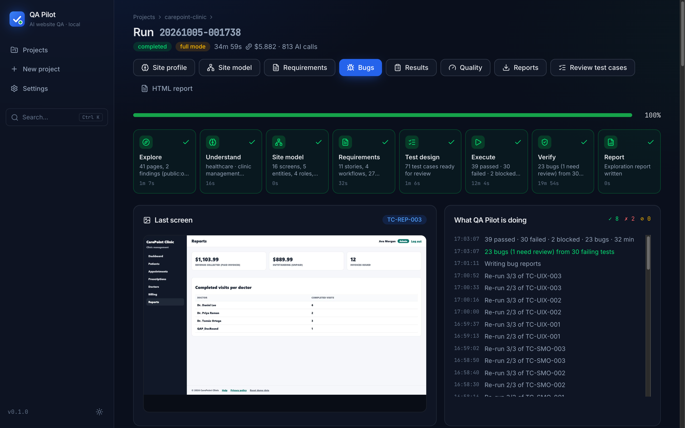<br><sub><b>Run overview</b> — the 8-stage pipeline with live progress</sub></td>
<td width="50%">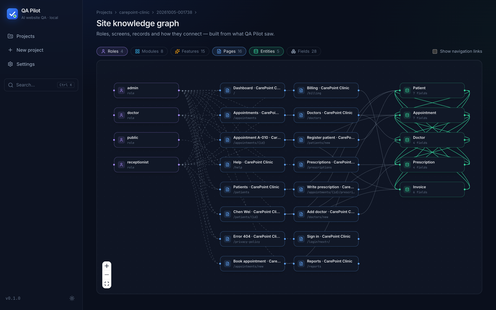<br><sub><b>Site knowledge graph</b> — roles, screens, records</sub></td>
</tr>
<tr>
<td>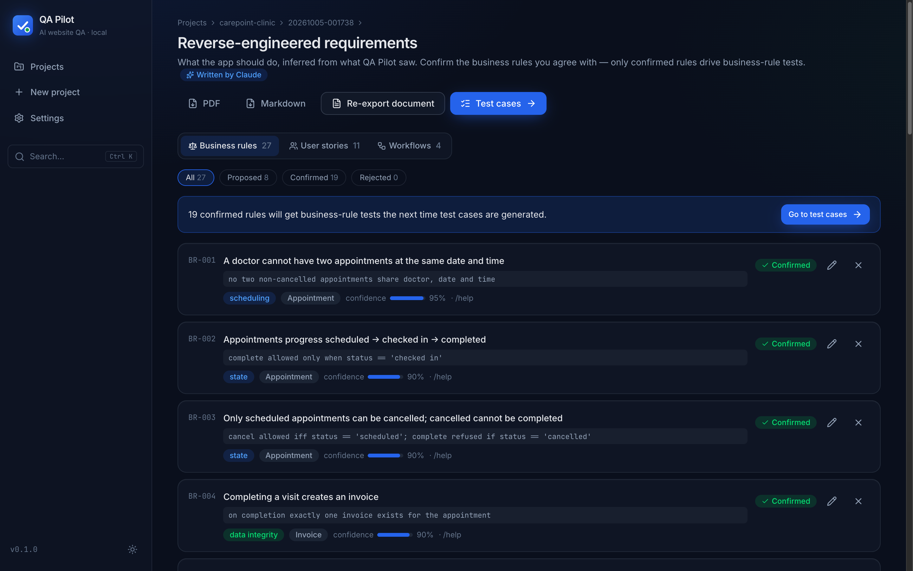<br><sub><b>Requirements</b> — stories, workflows, rules to confirm</sub></td>
<td>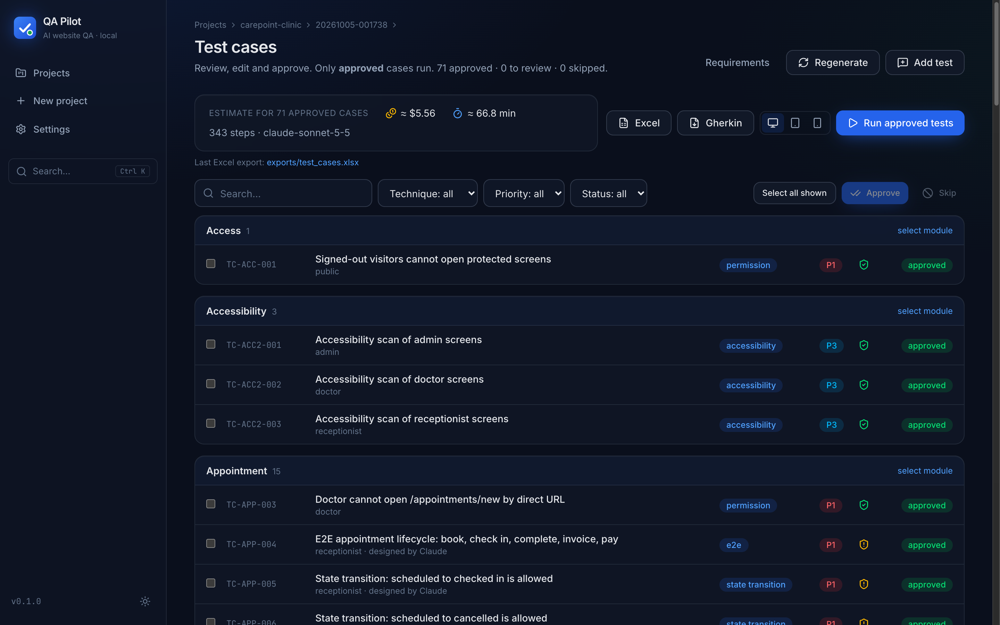<br><sub><b>Test cases</b> — review, edit, approve, cost estimate</sub></td>
</tr>
<tr>
<td>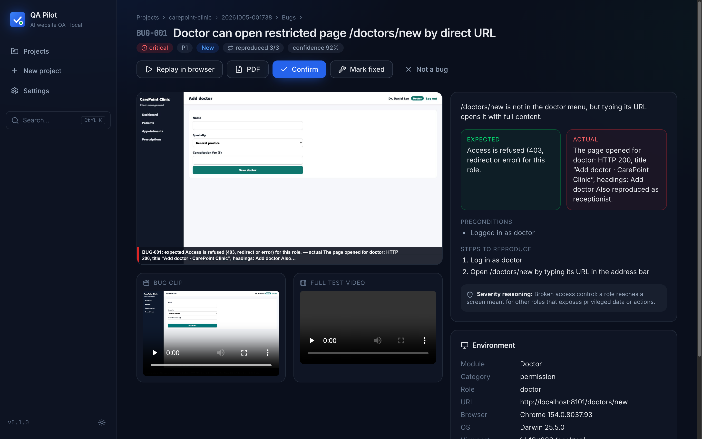<br><sub><b>Bug detail</b> — annotated evidence, clip, replay</sub></td>
<td>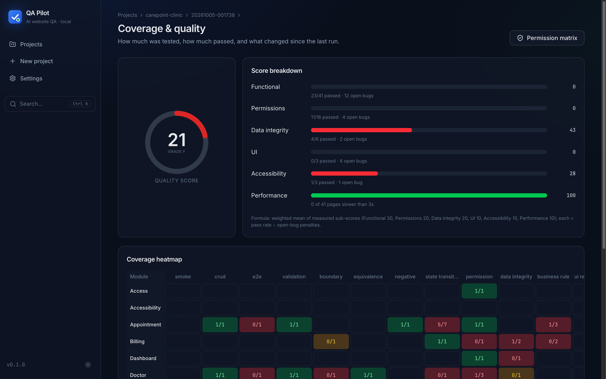<br><sub><b>Coverage & quality</b> — score, heatmap, regression</sub></td>
</tr>
<tr>
<td>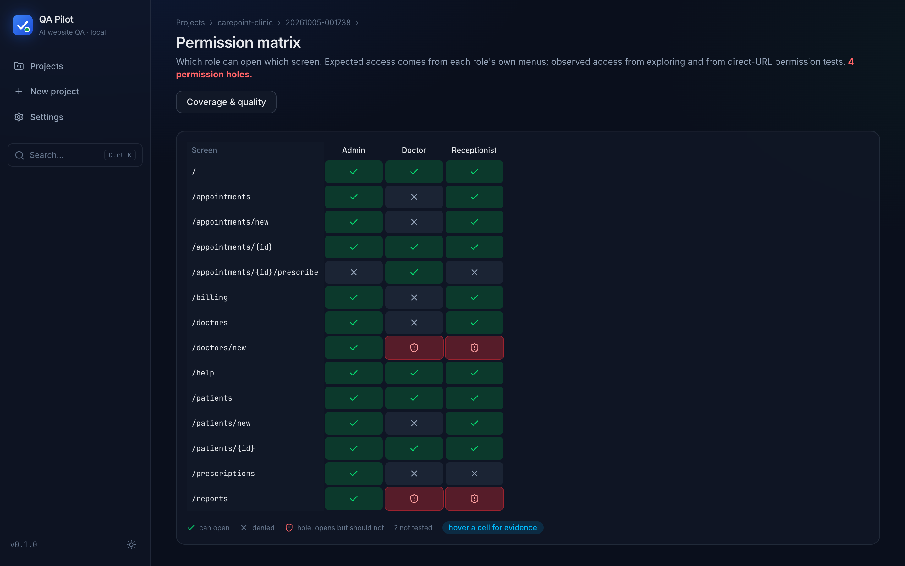<br><sub><b>Permission matrix</b> — holes in red</sub></td>
<td>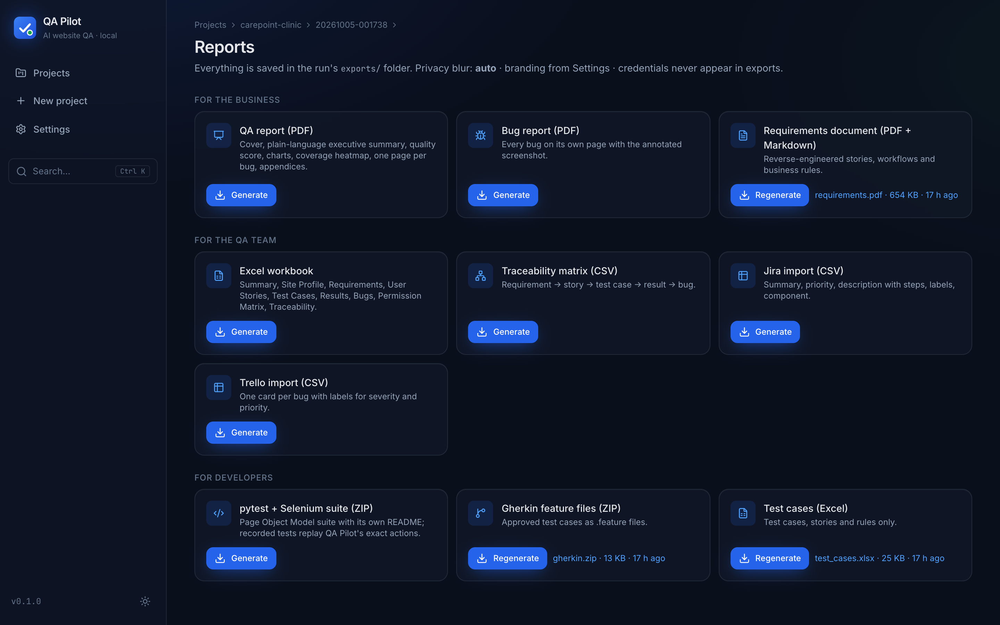<br><sub><b>Reports</b> — every export in one place</sub></td>
</tr>
</table>

More in [docs/assets/screenshots](docs/assets/screenshots) (including light mode).

## 📄 Sample outputs

Real exports from the DriveNow Rentals demo run:
[QA report (PDF)](docs/samples/qa_report.pdf) · [single bug (PDF)](docs/samples/BUG-003.pdf) ·
[Excel workbook](docs/samples/qa_report.xlsx) · [Jira CSV](docs/samples/bugs_jira.csv) ·
[pytest suite (ZIP)](docs/samples/pytest_suite.zip)

<details>
<summary><b>Example bug report</b> (as written by QA Pilot)</summary>

> **BUG-003 · 7-day booking gets no 10% weekly discount; total $840.00 instead of $756.00**
> `major` · `P2` · reproduced **3/3** · DriveNow Rentals · Chrome 154 · 1440×900 · role *agent*
>
> **Preconditions:** Tesla Model 3 ($120.00/day) available for 7 days · logged in as agent · customer Mei Tanaka exists
>
> **Steps to reproduce**
> 1. Open `/bookings/new`
> 2. Select Car: *Tesla Model 3 — $120.00/day*; Customer: *Mei Tanaka*
> 3. Enter pickup `2026-10-21` and return `2026-10-28` (7 days)
> 4. Click **Confirm booking** and look at subtotal, weekly discount and total
>
> **Expected:** 7 days: subtotal 840.00, discount 84.00 (10 %), total 756.00.<br>
> **Actual:** Days 7, Subtotal $840.00, Weekly discount −$0.00, Total $840.00.
>
> **Severity reasoning:** customers are overcharged $84.00 on every 7-day booking, with no workaround.<br>
> **Linked:** TC-BOO-022 · US-010 · BR-003 · WF-01 · evidence: annotated screenshot, 16 s clip, full video, console and network logs.

</details>

## 🧪 Test techniques

| Technique | Example | Runs as |
|---|---|---|
| Smoke | every page per role opens without errors | rule runner |
| CRUD · E2E | create a patient; book → check in → complete → invoice | AI agent |
| Validation · boundary · equivalence · negative | phone with letters, quantity max+1, return before pickup | AI agent |
| State transition | a cancelled booking cannot be handed over | AI agent |
| Permission | receptionist opens `/reports` by URL → must be refused | rule runner / AI agent |
| Data integrity | completing a visit updates dashboard and invoice | AI agent |
| Business rule | fee 120.00 at 50 % coverage → patient pays 60.00 (re-checked in Python) | AI agent |
| UI responsive · accessibility | no sideways scrolling at 390 px; axe-core WCAG A/AA | rule runner |

Full list and how results are decided: [docs/TEST_TECHNIQUES.md](docs/TEST_TECHNIQUES.md).

## 📊 Benchmarks

Measured on the three demo apps with [`scripts/benchmark.py`](scripts/benchmark.py) — real runs, Full Mode, test
environment. Each app has 15 planted bugs listed in an answer key the engine never reads; every match is listed with
its reason in [`docs/benchmarks.json`](docs/benchmarks.json) and was checked by hand
([corrections](docs/benchmark_overrides.json)).

| Demo app | Planted bugs found | Missed | Other genuine issues¹ | False positives | Tests run | Claude cost |
|---|---|---|---|---|---|---|
| CarePoint Clinic (healthcare) | **13/15** | CL-07, CL-14 | 7 | 2 of 23 | 71 (39 ✓ · 30 ✗) | $5.88 |
| DriveNow Rentals (car rental) | **15/15** (1 only in *Needs review*) | — | 2 | 1 of 20 | 60 (33 ✓ · 25 ✗) | $4.87 |
| StockRoom POS (retail) | **13/15** (2 only in *Needs review*) | SH-06, SH-12 | 4 | 6 of 24 | 63 (31 ✓ · 28 ✗) | $6.09 |
| **Total** | **41/45 (91 %)** | | 13 | 9 | | **$16.84** |

¹ Reports outside the answer key that the scorer judged to be real problems (e.g. extra layout overflow, colour
contrast); they are not verified by an answer key. 5 of the 9 false positives were already flagged *Needs review* (reproduced
only 1/3), mostly tests that ran in parallel on the same data; the other 4 rest on a wrong expectation in the test.
Model `claude-sonnet-5-5`; scores generated 2026-10-05.

## 📁 Where your data lives

<details>
<summary><code>workspace/</code> — plain files, safe to zip, move or delete</summary>

```
workspace/
├── settings.json                  # only the settings you changed
├── logs/qa-pilot.log              # secrets redacted
└── projects/<project>/
    ├── project.json               # URL, roles (no passwords), authorization record
    ├── secrets.enc                # role credentials, Fernet-encrypted
    ├── index.json                 # run list for fast loading
    └── runs/<run-id>/
        ├── run.json               # stages, progress, token usage, cost
        ├── crawl/pages.json       # every page, element, form, table
        ├── crawl/findings.json    # automatic checks
        ├── site_profile.json · site_model.json · requirements.json · testcases.json
        ├── executions/TC-….json   # every attempt, step by step
        ├── replay/TC-….json       # replayable action scripts
        ├── results.json · bugs.json · quality.json · permissions.json
        ├── artifacts/             # screenshots, videos, bug clips, logs
        └── exports/               # PDF, Excel, CSV, Gherkin, pytest suite
```

See [docs/STORAGE.md](docs/STORAGE.md).
</details>

## ⚙️ Configuration

<details>
<summary><code>.env</code></summary>

| Variable | Purpose |
|---|---|
| `ANTHROPIC_API_KEY` | your Claude API key (the onboarding screen writes it for you) |
| `ANTHROPIC_WORKSPACE_ID` | only for user-level keys that are not tied to a workspace |
| `QAP_MODEL` | Claude model (default `claude-sonnet-5-5`) |
| `QAP_SECRET_KEY` | encrypts role credentials — generated on first run, keep it |
| `QAP_WORKSPACE` | move the workspace folder elsewhere |

</details>

<details>
<summary><code>config/settings.yaml</code> (or <b>Settings</b> in the app)</summary>

| Section | Key settings |
|---|---|
| `ai` | model, effort, `run_cost_budget_usd` (a run stops cleanly when reached), response cache |
| `browser` | headless, window size, page-load timeout |
| `crawl` | max pages / depth, polite delay, slow-page threshold |
| `safety` | Safe Mode deny-list, always-blocked actions, safe form hints |
| `privacy` | domains that blur personal data by default |
| `execute` | steps / time / cost limit per test, re-runs, parallel workers |
| `branding` | company, client, accent colour and logo on reports |

</details>

## 🛡️ Safety & responsible use

- **Authorization required** — every project records *“I own this website or am authorized to test it”*.
- **Safe Mode by default** — nothing is deleted, paid, submitted or ordered. **Full Mode** only for staging/test,
  with a second confirmation and fake `QAP_` test data.
- **No attacks** — no CAPTCHA solving, 2FA bypass, brute force or exploitation.
- **Privacy blur** of emails, phone numbers and names in screenshots and exports (on by default for healthcare and
  banking).

Read [docs/LEGAL.md](docs/LEGAL.md) and [SECURITY.md](SECURITY.md).

## 🛠️ Tech stack

| Layer | Technology |
|---|---|
| Browser automation | Selenium 4 + Chrome DevTools Protocol, axe-core |
| AI | Anthropic Claude (structured outputs, tool use, prompt caching) |
| Backend | Python 3.11+, FastAPI, Server-Sent Events, Pydantic 2, NetworkX |
| Storage | JSON files with atomic writes and file locks — no database |
| Frontend | React 19, TypeScript, Vite, Tailwind CSS 4, shadcn/ui, React Flow, TanStack Query |
| Reports | Chrome print-to-PDF, openpyxl, imageio-ffmpeg |
| Quality | pytest, Vitest, Ruff, Black, mypy, GitHub Actions |

## ❓ Troubleshooting / FAQ

<details><summary><b>“Google Chrome: NOT FOUND”</b></summary>Install Chrome from google.com/chrome and run setup again. The driver is downloaded automatically on first use.</details>
<details><summary><b>API key errors</b></summary>Keys start with <code>sk-ant-</code>. A user-level key also needs <code>ANTHROPIC_WORKSPACE_ID</code>. “Credit balance is too low” → add credits in the Anthropic Console, then press <b>Resume</b>.</details>
<details><summary><b>Port 8000 is in use</b></summary>QA Pilot picks the next free port and prints it. Or choose one: <code>start.bat --port 8100</code>.</details>
<details><summary><b>PowerShell: “running scripts is disabled”</b></summary>Run the <code>.bat</code> files from Command Prompt or by double-clicking, or run <code>Set-ExecutionPolicy -Scope CurrentUser RemoteSigned</code> once.</details>
<details><summary><b>Antivirus blocks the driver</b></summary>Allow <code>%USERPROFILE%\.cache\selenium</code>, or download the matching chromedriver and set <code>SE_CHROMEDRIVER</code>.</details>

More: [docs/TROUBLESHOOTING.md](docs/TROUBLESHOOTING.md) · Known limits: [docs/KNOWN_ISSUES.md](docs/KNOWN_ISSUES.md)

## 🗺️ Roadmap

- [x] 8-stage engine, live viewer, bug replay, Quality Score, regression comparison
- [x] PDF / Excel / CSV / Gherkin / pytest exports
- [ ] Continuous CDP screencast instead of per-step frames
- [ ] Iframe and shadow-DOM support in the page snapshot
- [ ] Scheduled re-runs with e-mail / Slack summaries
- [ ] More domain packs (logistics, SaaS admin, government forms)

## 🤝 Contributing

Issues and pull requests are welcome — see [CONTRIBUTING.md](CONTRIBUTING.md). Changes: [CHANGELOG.md](CHANGELOG.md).

## 📜 License

[MIT](LICENSE)

---

<div align="center">


**Muzahidul Rahman**<br>
QA Automation Engineer & AI Automation Developer

Need QA automation or a custom testing tool for your app? Let's talk.

[](https://www.upwork.com/freelancers/YOUR_PROFILE)
[](https://github.com/YOUR_USERNAME)

</div>
