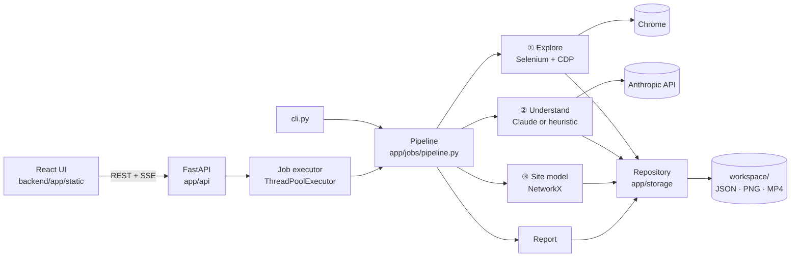

# Architecture

QA Pilot is a single local Python process: a FastAPI server that serves a pre-built React UI, runs jobs in a
thread pool, and stores everything as files in `workspace/`. The only network call leaving the machine is to the
Anthropic API (and, of course, the browser visiting the site under test).

## Layers

| Layer | Package | Responsibility |
|---|---|---|
| Storage | `app/storage` | Pydantic models, atomic JSON writes, locks, encrypted secrets, migrations. The only code that touches `workspace/`. |
| Core | `app/core` | Settings, paths, logging with secret redaction, Fernet crypto, Safe Mode guard |
| AI | `app/ai` | Claude client: structured JSON, retries, refusal fallbacks, prompt + response caching, token budget, cost |
| Browser | `app/browser` | Chrome session (CDP console/network), DOM snapshot with indexed elements, locators, login |
| Stages | `app/explore`, `app/understand`, … | One package per pipeline stage, each with a `stage.py` entry point |
| Jobs | `app/jobs` | Run lifecycle (`run.json`), pipeline, executor + event bus |
| API | `app/api` | REST endpoints, SSE live events, demo launcher |
| UI | `frontend/` | React + TypeScript + Tailwind; built into `backend/app/static` |

## Runs

A run moves through eight stages (explore → understand → model → requirements → design → execute → verify →
report). `run.json` records each stage's status and progress; overall progress is a weighted average. Each stage
first checks whether its output already exists, so an `interrupted` or `failed` run resumes where it stopped.
Events are broadcast to SSE subscribers and appended to `artifacts/logs/events.jsonl`, which the UI replays when a
run page is opened later.

## Understand: two classifiers

* **Claude (primary)** reads a compact summary of every screen (URL template, roles, headings, tables, forms with
  validation attributes, action buttons) plus up to four screenshots, and returns a strict JSON `SiteProfile`
  (`beta.messages.parse` with a Pydantic schema, adaptive thinking, `fallbacks: "default"`).
* **Heuristic (no API key)**: keyword scores from the Domain Packs over titles, headings, labels and table headers;
  entities from data-entry forms and tables; modules from the navigation menu. It refuses to guess (`other`) when
  the evidence is thin, and its confidence is capped at 0.75. Labelled `method: heuristic` everywhere.

## Safety

`SafetyGuard.check()` runs before every navigation, click and submit. URLs are judged by their path segments
(`/users/5/delete`), elements by text, attributes and context. Safe Mode is the default; Full Mode requires a
staging/test project and a second confirmation. See `docs/LEGAL.md` (Phase 7).

## Quality score

Defined in Phase 5 (sub-scores: functional, permissions, data integrity, UI, accessibility, performance).
