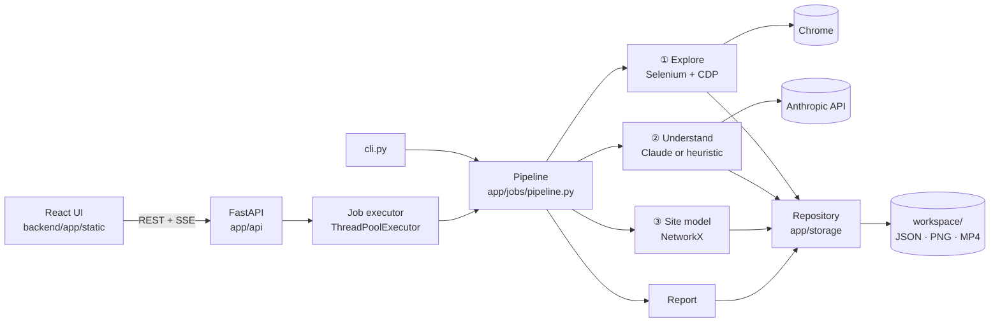

# Architecture

QA Pilot is a single local Python process: a FastAPI server that serves a pre-built React UI, runs jobs in a
thread pool, and stores everything as files in `workspace/`. The only network call leaving the machine is to the
Anthropic API (and, of course, the browser visiting the site under test).



## Layers

| Layer | Package | Responsibility |
|---|---|---|
| Storage | `app/storage` | Pydantic models, atomic JSON writes, locks, encrypted secrets, migrations. The only code that touches `workspace/`. |
| Core | `app/core` | Settings, paths, logging with secret redaction, Fernet crypto, Safe Mode guard |
| AI | `app/ai` | Claude client: structured JSON, retries, refusal fallbacks, prompt + response caching, token budget, cost |
| Browser | `app/browser` | Chrome session (CDP console/network), DOM snapshot with indexed elements, locators, login |
| Stages | `app/explore`, `app/understand`, … | One package per pipeline stage, each with a `stage.py` entry point |
| Jobs | `app/jobs` | Run lifecycle (`run.json`), pipeline, executor + event bus |
| API | `app/api` | REST endpoints, SSE live events, demo launcher |
| UI | `frontend/` | React + TypeScript + Tailwind; built into `backend/app/static` |

## Runs

A run moves through eight stages (explore → understand → model → requirements → design → execute → verify →
report). `run.json` records each stage's status and progress; overall progress is a weighted average. Each stage
first checks whether its output already exists, so an `interrupted` or `failed` run resumes where it stopped.
Events are broadcast to SSE subscribers and appended to `artifacts/logs/events.jsonl`, which the UI replays when a
run page is opened later.

## Understand: two classifiers

* **Claude (primary)** reads a compact summary of every screen (URL template, roles, headings, tables, forms with
  validation attributes, action buttons) plus up to four screenshots, and returns a strict JSON `SiteProfile`
  (`beta.messages.parse` with a Pydantic schema, adaptive thinking, `fallbacks: "default"`).
* **Heuristic (no API key)**: keyword scores from the Domain Packs over titles, headings, labels and table headers;
  entities from data-entry forms and tables; modules from the navigation menu. It refuses to guess (`other`) when
  the evidence is thin, and its confidence is capped at 0.75. Labelled `method: heuristic` everywhere.

## Safety

`SafetyGuard.check()` runs before every navigation, click and submit. URLs are judged by their path segments
(`/users/5/delete`), elements by text, attributes and context. Safe Mode is the default; Full Mode requires a
staging/test project and a second confirmation. See `docs/LEGAL.md` (Phase 7).

## Quality score

Computed in `app/verify/insights.py` at the end of Verify (stored in `quality.json`, shown in the run summary) and
recomputed whenever a bug is triaged.

| Sub-score | Weight | Measured from |
|---|---|---|
| Functional | 30 | smoke, CRUD, E2E, validation, boundary, equivalence, negative, state transition, business rule tests |
| Permissions | 20 | permission tests |
| Data integrity | 20 | data-integrity tests |
| UI | 10 | responsive tests |
| Accessibility | 10 | axe-core tests |
| Performance | 10 | share of explored pages that loaded under `crawl.slow_page_ms` |

```
sub_score = 100 × passed / executed  −  Σ open-bug penalties in that category   (clamped to 0–100)
            penalties: critical 25 · major 12 · minor 5 · trivial 1   (rejected and fixed bugs don't count)
overall   = Σ weight × sub_score / Σ weight      over measured categories only
grade     = A ≥ 90 · B ≥ 75 · C ≥ 60 · D ≥ 40 · F
```

Blocked and errored tests are not "executed": they lower coverage (heatmap), not the score. Calculation, rule,
state and validation bugs count against Functional.

## Other Phase 5 views

- **Coverage heatmap** — module × technique; green all passed, red any failure, amber partly run/blocked, grey not
  run, dashed no tests (a gap).
- **Permission matrix** (`permissions.json`) — roles × screens. *Expected* allow = the role reached the screen from
  its own menus while exploring; otherwise deny. *Observed* = exploration (allow) and direct-URL permission tests
  (allow / deny). Expected deny + observed allow = a hole.
- **Regression comparison** — open bugs of this run vs. a chosen earlier run, matched by symptom key:
  new · fixed · still open · reappeared (absent in the base run but present in an older one).
- **Business-rule recalculation** (`app/verify/rule_check.py`) — Claude only reads numbers off the final page and
  writes the rule as an expression; Python evaluates it with a whitelisted AST evaluator (numbers, arithmetic,
  comparisons, and/or/not, round/min/max/abs — no names except the extracted values, no attributes or calls
  beyond those four). A false result fails a test the agent passed.
- **Privacy blur** (`app/execute/privacy.py`) — every screenshot gets a `.pii.json` sidecar with the boxes of
  emails, phone numbers, person columns, labelled person fields and the signed-in user's name. Originals stay intact;
  bug evidence, videos and exports use blurred copies when the project's setting is on (Auto = healthcare and banking).
- **Multi-viewport runs** — the Run button can add tablet (768×1024) and phone (390×844); each test runs again at that
  size as `TC-…@mobile`, and its bug report records the viewport.
