# QA Pilot — case study

*Give it a URL. It learns the app, writes the tests, runs them, and reports the bugs.*

**Muzahidul Rahman** · QA Automation Engineer & AI Automation Developer ·
[PDF version](export/QA-Pilot-Case-Study.pdf) · [Source](https://github.com/YOUR_USERNAME/qa-pilot)

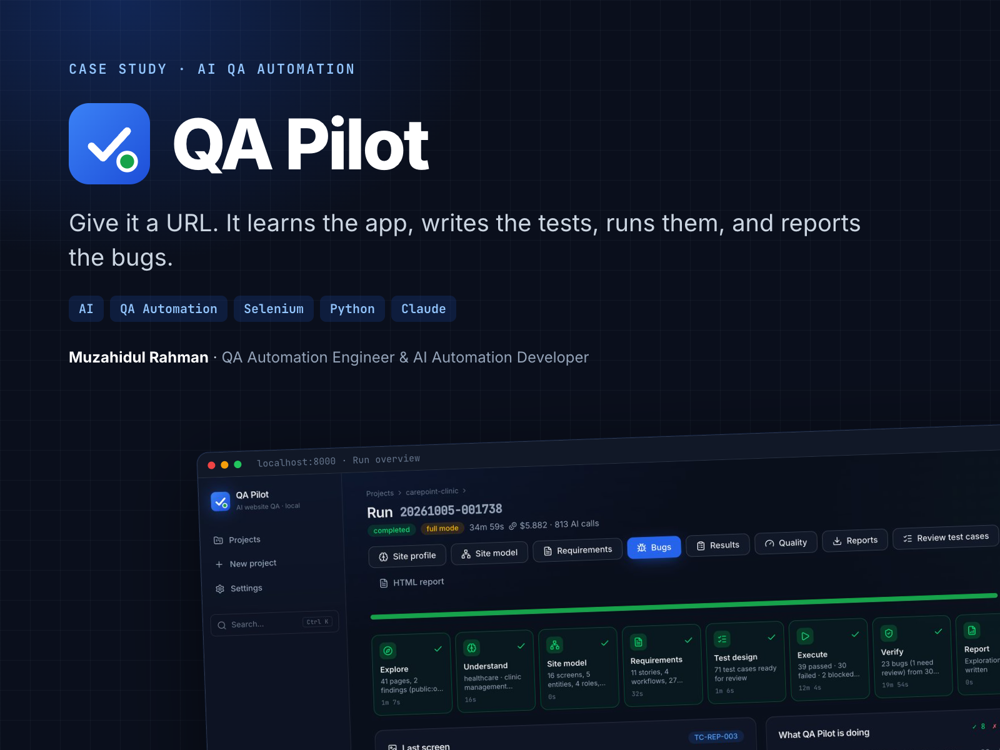

## The challenge

Small teams ship web apps that nobody really tested. Clicking through every role and every form before each
release takes days, so it gets skipped. The worst bugs — a role that can open someone else’s data, an invoice that
ignores a discount, a cancelled order that can still be completed — hide in screens only some users reach. And when
bugs are reported, the report says “it doesn’t work” without steps, data or evidence.

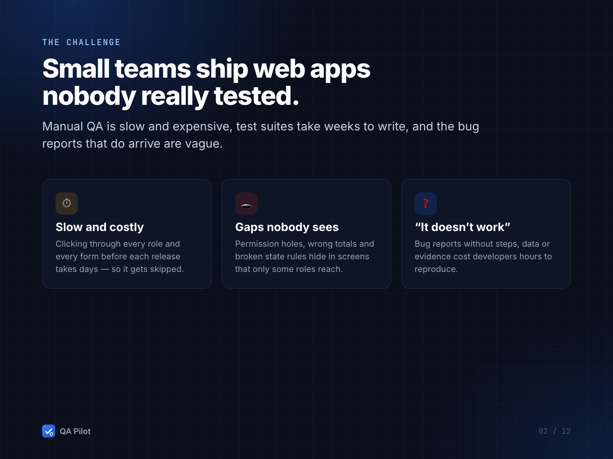

## The solution

QA Pilot is an AI QA engineer that runs on your own computer. It explores the app like a new tester, writes down
what the app should do, tests it in a real browser and proves every bug it reports — in eight stages:
**Explore → Understand → Site model → Requirements → Test design → Execute → Verify → Report**.

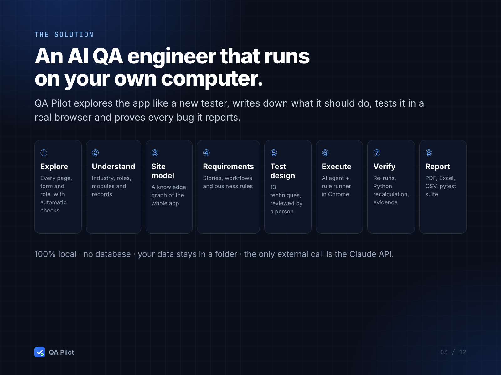

## Process

1. **Explore** — a Selenium crawler signs in as each role, records every page, form, table and link, and runs
   automatic checks (HTTP errors, broken links, JavaScript errors, slow pages, layout overflow).
2. **Understand and model** — domain packs plus Claude identify the industry, roles, modules and records; a
   knowledge graph shows which role reaches which screen.
3. **Requirements** — user stories, workflows with state machines, and business rules. A person confirms them.
4. **Test design** — 13 techniques, with test data and computed expected values; a person approves the cases.
5. **Execute** — an AI agent drives Chrome one action at a time (every action passes a Safe Mode guard); rule-based
   checks cover smoke, permissions, responsive layout and accessibility.
6. **Verify** — every failure is re-run; numbers in business rules are re-checked in Python.
7. **Report** — bug reports with annotated screenshots and clips, Quality Score, PDF/Excel/CSV and a pytest suite.

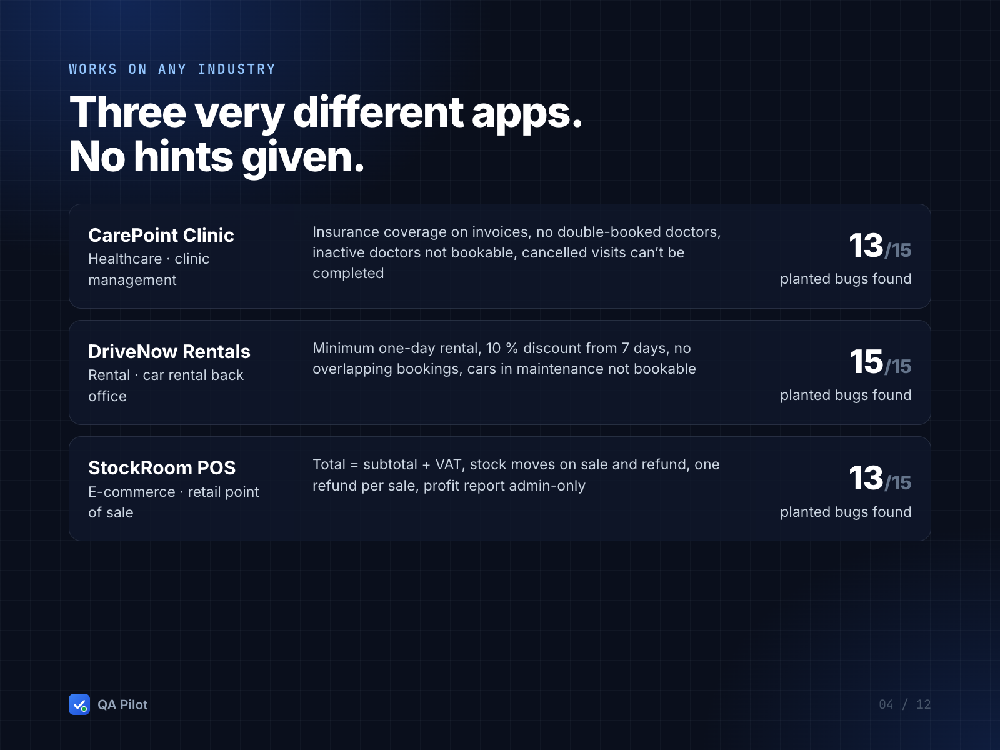
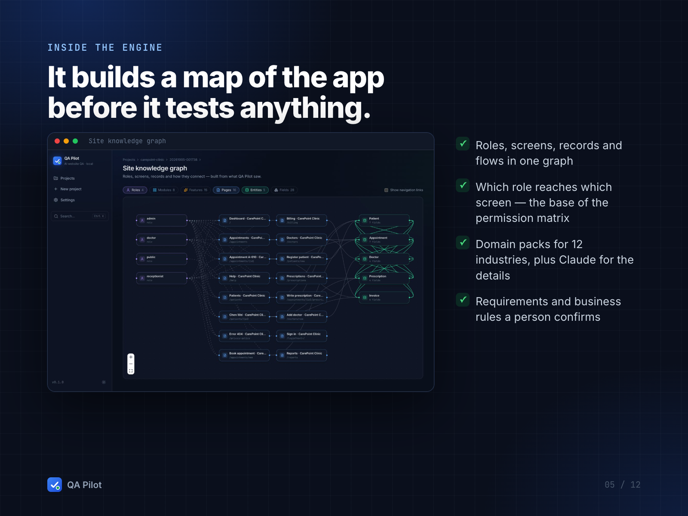
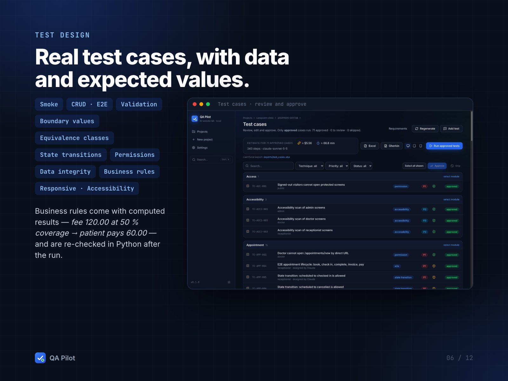

## Features

- Live Run Viewer with the agent’s browser and a step log
- Bug reports with steps and data, expected vs actual, severity reasoning, annotated screenshot, 10–25 s clip,
  full video, console and network logs, one-click replay
- Role permission matrix (expected vs observed, holes highlighted), coverage heatmap, Quality Score, regression
  comparison between runs
- Multi-viewport runs, privacy blur, plain-English test authoring
- Exports: PDF QA report (business summary + technical detail), Excel workbook, Jira / Trello CSV, traceability
  matrix, Gherkin, pytest + Selenium Page Object suite

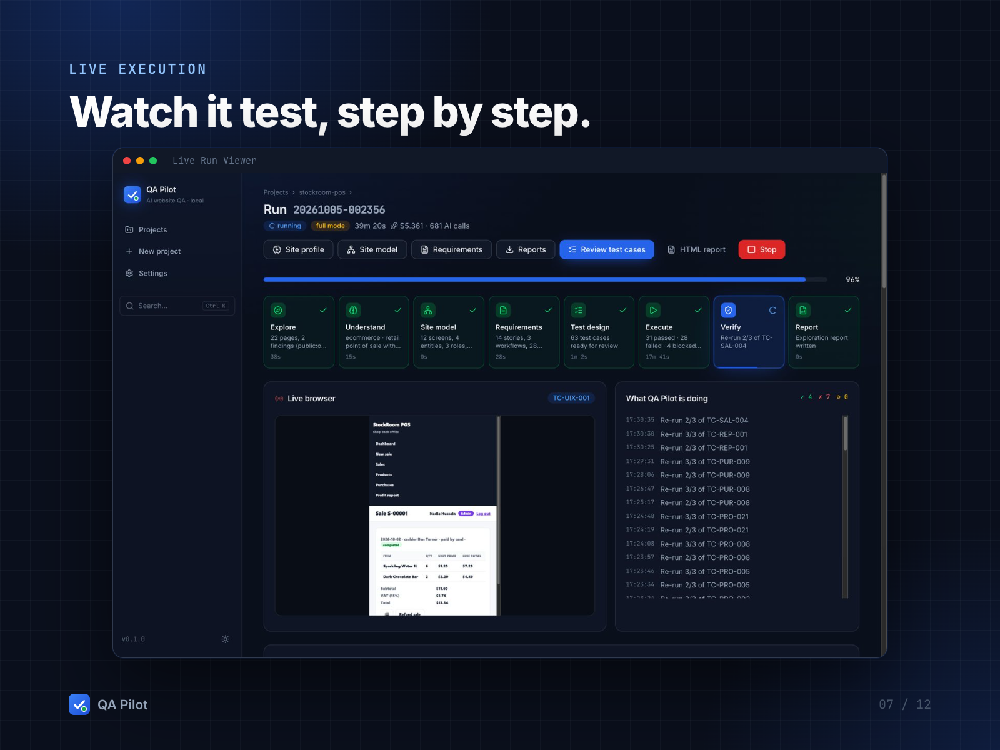
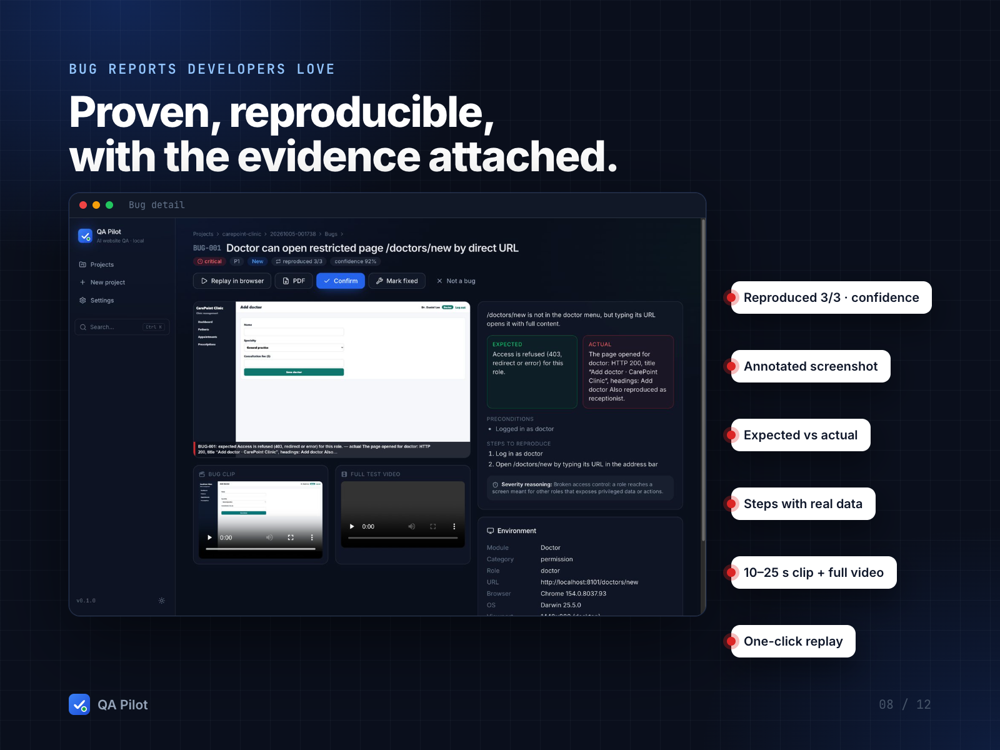

## Engineering

- **Agent loop** — one tool call per Claude turn over an indexed element list plus a screenshot, with working memory
  and loop detection; strict tool schemas; token and cost budgets per test and per run.
- **Self-healing replay** — each agent run becomes a replay script with multi-strategy locators; a failure is
  re-run by replaying and re-judging, and a broken locator hands control back to the agent.
- **Trustworthy verdicts** — reproducibility (3/3 confirmed, 1/3 → *Needs review*), Python recalculation of business
  rules through a whitelisted expression evaluator.
- **Safety** — authorization record per project, Safe Mode by default, Full Mode only on test/staging, encrypted
  credentials, privacy blur, secret-scanning git hook.
- **Local, file-based** — no database: atomic JSON writes, file locks, schema versions and migrations; runs survive
  restarts and can be resumed.

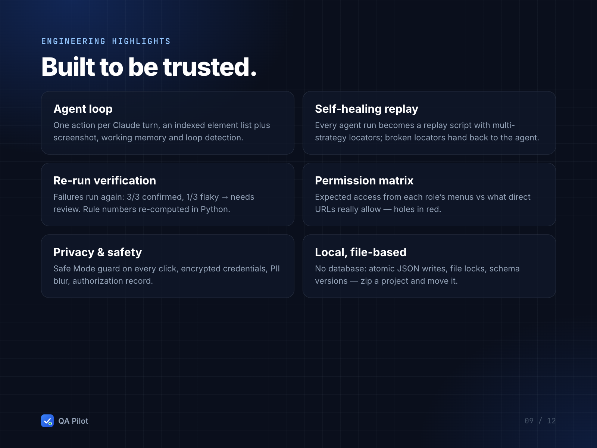

## Results

Measured with `scripts/benchmark.py` on three demo apps with 15 planted bugs each (answer keys the engine never
reads; every match listed and checked in `docs/benchmarks.json`):

| Demo app | Planted bugs found | False positives | Tests | Claude cost |
|---|---|---|---|---|
| CarePoint Clinic | 13/15 | 2 | 71 | $5.88 |
| DriveNow Rentals | 15/15 | 1 | 60 | $4.87 |
| StockRoom POS | 13/15 | 6 | 63 | $6.09 |
| **Total** | **41/45 (91 %)** | **9 of 67 reports** | **194** | **$16.84** |

Three of the 41 were reported only in the *Needs review* queue (reproduced 1/3). The exported pytest suite for
DriveNow Rentals ran against the app with 49 passing tests and 9 failing — each failure a bug QA Pilot had reported.

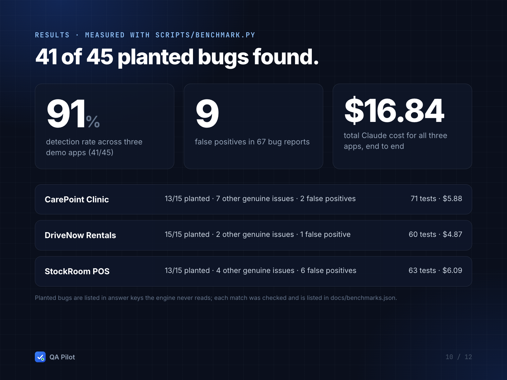

## Tech stack

Selenium 4 · Chrome DevTools Protocol · Anthropic Claude · Python · FastAPI · Server-Sent Events · Pydantic ·
NetworkX · React 19 · TypeScript · Tailwind · shadcn/ui · React Flow · axe-core · openpyxl · ffmpeg · pytest · Vitest

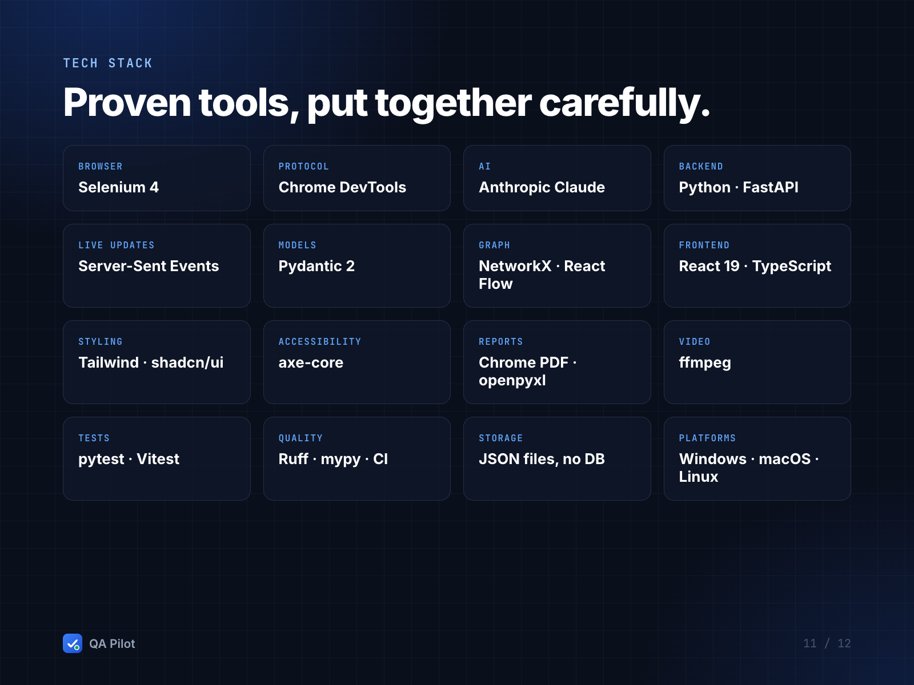

## Want automated QA for your web app?

I build QA automation and custom AI testing tools — from Selenium suites to engines like this one.
[Hire me on Upwork](https://www.upwork.com/freelancers/YOUR_PROFILE)

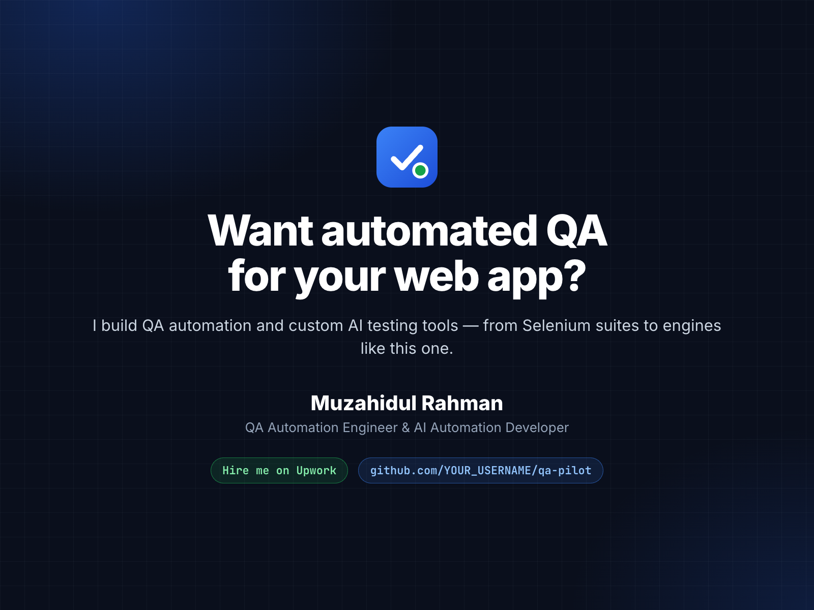
